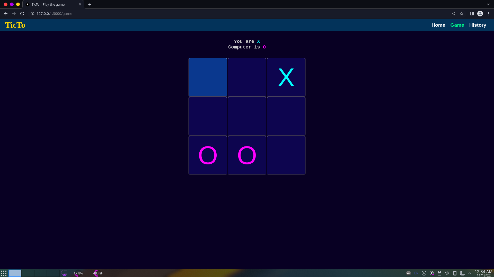

# TicTo

A simple offline TicTacToe game written in Next.js and Typescript.

You can play it here: [https://ticto.vercel.app/](https://ticto.vercel.app/)

## Home page

The home page doesn't contain much, just a link to the game page.

## Game page

The game page contains the game itself. The game is played on a 3x3 grid. The game is played by two players, X and O. The first player to get 3 of their marks in a row (up, down, across, or diagonally) is the winner. When all 9 squares are full, and no player has 3 marks in a row, the game is a draw.

## History page

Here you can see the history of all the games played. The history is stored in the browser's local storage.

## License

The code is licensed under the MIT license. See the LICENSE file for more details.
